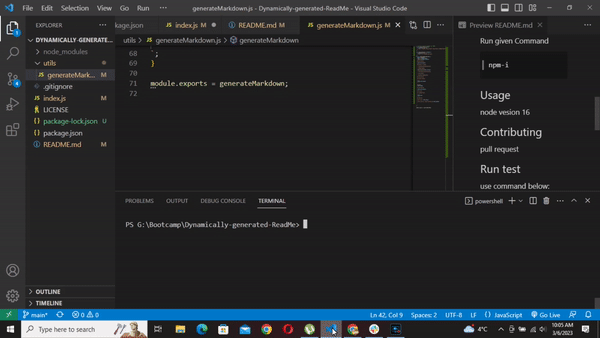

# README_Generator
  

  ### Discription

  Create dynamic readme file for your project

  ### Table of content.

  * [Installation](#installation)

  * [Usage](#usage)

  * [License](#license)

  * [Contributing](#contributing)

  * [Test](#Test)

  * [Questions](#questions)

  ## Installation

  Run given Command
  
  ```
  npm-i
  ```


  ## Usage
  node 16

  ## License

  
 * [License](#license)

  ## Contributing

  pull request

  ## Test

  use command below:
  
  ```
  npm run test
  ```

  ## Questions

  write me at: dineshthapa2000@gmail.com

  view my work at: https://github.com/AjinThapa2000
  
  ## Screen Record of Project
  
  

  

